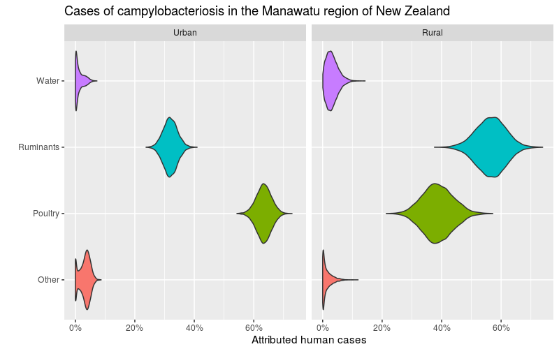

<!-- badges: start -->
[](https://github.com/jmarshallnz/islandR/actions)
[](https://codecov.io/gh/jmarshallnz/islandR?branch=master)
<!-- badges: end -->

# islandR

The islandR package allows source attribution using the island genomic model (and in the future, other
genomic models).

This allows the attribution of cases of disease to their likely sources.

The assymmetric island model estimates the sampling distribution of genotypes on sources by using
the genetic distance between isolates to infer mutation and recombination rates in addition to
migration rates between sources. This allows improved estimation of the sampling distribution over
and above that achieved using just the prevalence of each type. Further, it allows estimating the
likely prevalence of unobserved genotypes.

## Installation

islandR is not currently available from CRAN, but you can install it from github with:

```R
# install.packages("remotes")
remotes::install_github("jmarshallnz/islandR", subdir="pkg")
```

## Usage

An example to fit the model and provide attribution probabilities using the included example dataset is below.

```R
library(islandR)

# Take a look at the expected data format using an example dataset
head(manawatu)

# Fit the sequence type distribution using the island model
st = st_fit(formula = Source ~ ST,
            non_primary = "Human",
            data = manawatu,
            method="island",
            sequences = ~ ASP + GLN + GLT + GLY + PGM + TKT + UNC)

# see some summaries of these
summary(st)

# Fit the attribution model for human cases, estimating separately by location (urban/rural)
dat = subset(manawatu, Source == "Human")
dat$Location = factor(ifelse(dat$UR2006_num <= 0, "Rural", "Urban"))
mod = attribution(ST ~ Location, st, data=dat)

# Various model summaries
summary(mod)
predict(mod, FUN=mean)
```

The package is designed to make use of the [tidyverse](http://tidyverse.org) for further processing of output. The `predict` function returns a `data.frame` for this purpose.

```
# Use ggplot2 for prettier plots. The predict() function returns a data.frame
# ready for the tidyverse, but it's useful to first tidy up the X variable (model
# frame for attribution) as needed.

library(dplyr)
library(forcats)
library(ggplot2)

# grab the full posterior (all samples)
posterior <- predict(mod, FUN=identity)

df <- posterior %>% mutate(Location = fct_recode(X,
                                        Urban = '(Intercept)=1:LocationUrban=1',
                                        Rural = '(Intercept)=1:LocationUrban=0'))

ggplot(df) +
  geom_violin(aes(x=Source, y=p, fill=Source), scale="width") +
  coord_flip() +
  scale_y_continuous("Attributed human cases", labels=scales::percent) +
  xlab("") +
  facet_grid(. ~ Location) +
  guides(fill=FALSE) +
  ggtitle("Cases of campylobacteriosis in the Manawatu region of New Zealand")
```


